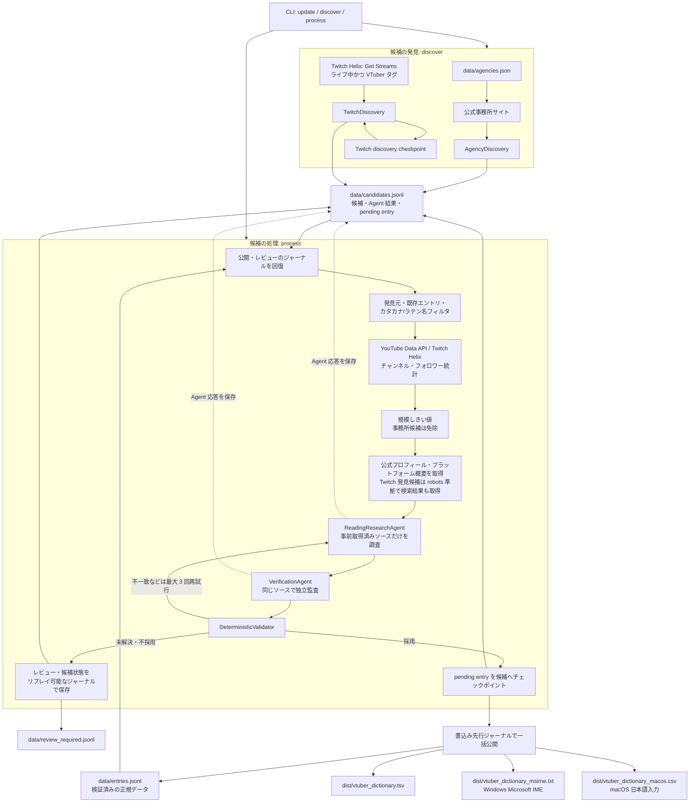

# VTuber Dictionary

日本の VTuber 名を、ひらがなの読みから正式名称へ変換する IME 辞書作成用 Python パイプラインです。

## 辞書を使う

[Releases](https://github.com/AkioPonkotu/VTuberDictionary/releases/latest) の **Assets** から、使う OS 用のファイルをダウンロードします。

- **Windows:** `vtuber_dictionary_msime.txt` をダウンロードし、Microsoft IME の「ユーザー辞書ツール」で **ツール → テキスト ファイルからの登録** を選んで読み込みます。
- **macOS:** `vtuber_dictionary_macos.csv` をダウンロードし、「日本語入力」のユーザ辞書で **辞書を開く → ファイル → 開く** を選んで読み込みます。


## セットアップ

以下は、Cloneして自分で辞書を作成する場合の説明です！

Python 3.12 と [uv](https://docs.astral.sh/uv/) が必要です。

```powershell
uv sync --all-groups
Copy-Item .env.example .env
uv run pytest
uv run ruff check .
uv run mypy src
```

`.env` に次を設定します。

| Variable | Purpose |
| --- | --- |
| `OPENAI_API_KEY`, `OPENAI_MODEL` | Microsoft Agent Framework 経由の調査・検証 Agent |
| `YOUTUBE_API_KEY` | YouTube Data API のチャンネル統計・概要 |
| `TWITCH_CLIENT_ID`, `TWITCH_CLIENT_SECRET` | Twitch Helix の発見・統計 |
| `YOUTUBE_MIN_SUBSCRIBERS` | 既定 10000 |
| `TWITCH_MIN_FOLLOWERS` | 既定 5000 |
| `AUDIENCE_THRESHOLD_MODE` | 既定 `any`（YouTube **または** Twitch）。`all` も利用可能 |
| `TWITCH_DISCOVERY_ENABLED`, `TWITCH_DISCOVERY_LANGUAGE`, `TWITCH_DISCOVERY_TAG`, `TWITCH_DISCOVERY_MAX_PAGES` | Twitch の収集範囲。language を空にすると言語制限なし |
| `TWITCH_CRAWLER_ENABLED`, `TWITCH_CRAWLER_MAX_RESULTS`, `TWITCH_CRAWLER_DELAY_SECONDS` | Twitch 発見候補だけに使う、API キー不要の Web クローラ（既定は上位 3 件・リクエスト間隔 1 秒） |

`uv sync` は Microsoft Agent Framework の OpenAI provider もインストールします。Agent は
Pydantic response format だけを指定して実行します。Web Search tool は使用しません。

`OPENAI_MODEL` は必須です。


## 実行

事務所は `data/agencies.json` に登録します（初期状態は空です）。事務所をコードへ埋め込まないため、追加・無効化はこのデータだけで行えます。

```json
[
  {
    "name": "Example Agency",
    "official_url": "https://example.com",
    "talent_list_url": "https://example.com/talents",
    "profile_url_pattern": "^/talents/[^/]+/$",
    "active": true
  }
]
```

`profile_url_pattern` は任意です。タレント以外のナビゲーションリンクを候補にしないため、公式サイトのプロフィールURL形式が分かる場合は指定します。

```powershell
uv run vtuber-dictionary update
# 取得元を限定する場合
uv run vtuber-dictionary update --source agency
uv run vtuber-dictionary update --source twitch
```

`--source` は複数回指定できます。指定しない場合は事務所・Twitch の両方を取得します。これは候補の**発見元**だけを限定するオプションで、既存候補の YouTube/Twitch 統計による検証は維持されます。

CI では中断後に発見済み候補を再利用できるよう、発見と後続処理を分けて実行できます。

```powershell
uv run vtuber-dictionary discover --source agency  # 候補だけを永続化
uv run vtuber-dictionary process                   # 永続化済み候補を調査・検証・公開
```

`update` は従来どおり両方を順に実行します。GitHub Actions の定期更新では `discover` の結果を先にコミットしてから `process` を実行するため、後者の外部 API または Agent 呼び出しが失敗しても、次回実行は発見済み候補から再開します。

### Twitch の定期更新（GitHub Actions）

`.github/workflows/update-twitch.yml` は UTC の毎時 `:23`、4時間おき（JST では 01:23、05:23、09:23、13:23、17:23、21:23）に実行されます。手動実行も Actions 画面の **Update dictionary from Twitch** から可能です。事務所更新と同じキューを共有するため、同時に辞書データを更新しません。

有効化前に、リポジトリの Actions secrets に `TWITCH_CLIENT_ID`、`TWITCH_CLIENT_SECRET`、`OPENAI_API_KEY` を、Actions variables に `OPENAI_MODEL` を設定してください。`YOUTUBE_API_KEY` は任意です。ワークフローは候補・辞書・配布成果物をコミットし、Release を公開するため、Actions の `GITHUB_TOKEN` に **Contents: read and write** を許可し、ブランチ保護を使用する場合は GitHub Actions の push を許可してください。必須設定が不足している場合は、候補収集を行わず明示的に失敗します。

OpenAI の認証情報がない場合も、閾値に達した候補が現れるまで候補収集は実行できます。その候補を調査・採用する段階で停止するため、未検証の情報が辞書へ入ることはありません。

実行中の永続データは次のとおりです。

```text
data/agencies.json             Versioned agency registry
data/candidates.jsonl          Candidate identity cache (execution state)
data/entries.jsonl                         Verified canonical data
data/review_required.jsonl                 Rejected/ambiguous cases and reasons
data/twitch_discovery_checkpoint.json      Twitch page cursor while a scan is incomplete
dist/vtuber_dictionary.tsv                 Legacy UTF-8 two-column TSV
dist/vtuber_dictionary_msime.txt           Windows Microsoft IME bulk-registration dictionary
dist/vtuber_dictionary_macos.csv           macOS Japanese Input professional dictionary
```

候補ごとに、Agent の確定結果は先に `candidates.jsonl` へチェックポイントされます。`entries.jsonl` と全配布成果物の
更新は書込み先行ジャーナルで保護され、途中停止した場合は次回起動時に同じ確定内容をすべてへ再適用します。
レビュー状態とレビュー記録も同じ方式で回復するため、再実行で同じレビュー行を追加しません。Twitch は候補ページを
保存してから次ページのカーソルを保存するので、失敗時は最大でも直前のページを安全に再取得します。

配布形式は次のとおりです。

| 対象 | ファイル | 1行の形式 |
| --- | --- | --- |
| Windows Microsoft IME | `vtuber_dictionary_msime.txt` | `reading<TAB>word<TAB>固有名詞`（UTF-16 LE、BOM、CRLF） |
| macOS 日本語入力 | `vtuber_dictionary_macos.csv` | `reading,word,proper noun`（CSVエスケープ済み） |

macOS版は専門辞書として読み込みます。出力時に読み32文字以内、語句64文字以内、CSVエスケープ後の1行127文字以内を検査します。

## 調査・検証ポリシー

Agent を呼ぶ前に、アプリケーションが候補の公式プロフィール URL と、公式 API から取得済みの
YouTube/Twitch 概要を取得し、本文を上限付きで Agent に渡します。Twitch の `VTuber` タグから
発見した候補だけは、DuckDuckGo の非 JavaScript 検索結果を 1 回クロールし、`robots.txt` を尊重して
上位 URL を最大 3 件取得します。Agent には Web Search tool を渡さないため、OpenAI 側の検索回数と
検索コンテキストのコストは発生しません。公式プロフィールを取得できない候補は、その情報だけで
解決できなければ `unresolved` となります。

ReadingResearchAgent は事前取得した公式事務所プロフィール、本人プロフィール、YouTube/Twitch
概要から読みを調査します。すべての候補を VerificationAgent が同じ事前取得ソースで監査します。
公式根拠のない漢字・ローマ字からの推測は `unresolved` となり、採用されません。

同一人物の統合は YouTube channel ID、Twitch user ID、または公式プロフィール URL の一致だけで行います。表示名が一致するだけでは統合せず、曖昧なものは `review_required` です。候補の元の表示名を Unicode 正規化した上で、実質文字がカタカナとラテン文字だけの場合は `rejected` とし、プラットフォーム API や OpenAI Agent を呼ぶ前に除外します。漢字またはひらがなを含む候補は除外しません。既存エントリと Agent の正式表記にも同じ判定を適用して、別名の併記による漏れを防ぎます。既に辞書化された候補は canonical ID、YouTube channel ID、または Twitch user ID の一致で判定し、プラットフォーム API・公式ページ取得・OpenAI Agent による調査および検証の対象から除外します。

Twitch Discovery は Helix の **Get Streams** をページングして `VTuber` タグ（大文字小文字を区別しない）を持つライブ配信者だけを発見します。ライブ中でない VTuber を一度に検索する仕組みではありません。そのため `candidates.jsonl` を実行をまたいで保持し、候補集合を少しずつ増やします。


## テスト

`tests/` は external API を使わない unit test です。Twitch follower API の opt-in smoke test は次で実行できます。

```powershell
$env:TWITCH_SMOKE_BROADCASTER_ID = "..."
uv run pytest tests/integration --override-ini="addopts=--strict-markers"
```


## アーキテクチャ



`update` は `discover` の後に `process` を実行します。`discover` と `process` は個別にも実行でき、GitHub Actions では発見結果をコミットしてから処理するため、中断後も候補を再利用できます。`domain.py` は外部サービスから独立したデータ構造です。HTTP API と Agent は protocol/adapter を介し、テストでは fake に置換します。YouTube/Twitch の規模判定は通常の Python コードと公式 API の値だけで行い、LLM には委ねません。
